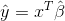

# CodingMachineLearning
In this repository I put all coded Machine Learning Algorithms I did from scratch. [Just for practice]
____________________
### Linear Regression

Simple linear regression implementation using residual sum of square as loss function. As can be easily proved, a vector β can be found to minimize

and this vector is determined by:

(Where X is the dataset matrix with a 1s-column as first column in order to have a bias β0 in the β vector and y is the label vector of the dataset)
With that vector is possible to linear approximate a value y-hat from the sample features as

where x is the new sample vector (with a 1 at begining for beta bias).
For this implementation has been used this [dataset](http://people.sc.fsu.edu/~jburkardt/datasets/regression/x07.txt). It's about a mental retardation index and distrust index that psychiatrists assigned to their patients.

### Decision Tree
Is a classical decision tree building in R. It filters questions using information gain for splitting branches and measure  impurity using Gini impurity.

Three kinds of node are defined:
* Node: common interface for different nodes
* QuestionNode: decision node that divide the classification in two branches
* Leaf: contains the answer for a classification

Questions are modeled as objects containing index and value of the splitting variable. 

The used training set is the [Iris Dataset](https://archive.ics.uci.edu/ml/datasets/iris).
&nbsp;
_________________________

### K-Means Clustering
Classical K-means clustering algorithm. It builds clusters regrouping those with similar features. 

To simplify the code has been built a class "Cluster" to store the elements of the dataset and the cluster's centroid. This class has just two methods: one to recompute the centroid (computing the element in the cluster, not only a "mean element") and one to add an element to the matrix.

To better visualize the result a synthetic 2-d dataset has been used (format of the dataset has been manually changed for simplify the reading). This dataset contains 5000 six digits couples of numbers and can be retrieved here: [S1](https://cs.joensuu.fi/sipu/datasets/).
The end result of the clustering for k = 15 is the following:

___________________________

### Bayesian Classifier (for a specific case)
As proved in [Elements of Statistical Learning](https://www.amazon.com/Elements-Statistical-Learning-Prediction-Statistics/dp/0387848576/ref=pd_lpo_sbs_14_img_0?_encoding=UTF8&psc=1&refRID=DAQ91A4V0TX92WAGKW1Y), to better statistically predict a categorical variable using a 0-1 loss function is to choose the label g that maximize 

Where X is a random variable and x is the vector assumed in the sample.
So in this code there are 200 two-dimensionals values generated as follows:
* 10 "blue" elements "m_blue" are generated from the multivariate normal distribution N([0,1]', I).
* 10 "orange" elements "m_orange" are generated from N([1,0]', I).
* 100 m_blue are selected (with replace) and used to create a sample "X_blue" from the multivariate normal distribution N(m_blue, I/5). So at the end of this point there are 100 samples X labeled as blue.
* 100 m_orange are selected to do the same. So there are other 100 samples X tagged as orange.

Now, given a random X, the code try to guess what is the most probable distribution from which is generated X.
A single vector X can be written as 

Since the two features are independent of each other, the code calculate (for each individual of the sample) two confidence interval for both the variables of each distribution. The confidence interval is initialized with an alpha that covers the 95% of the one-dimensional distribution. If a feature of the individual is in both distributions confidence intervals (of that feature), the intervals are cut reducing the alpha of 0.1%. After that will be checked again the belonging of the feature to those new intervals. In another case, if a feature of the individual is not in any interval, those are enlarged increasing alpha of 0.1%. This process will stop when just one multivariate distribution have both the features of the individual in both its confidence intervals. 

The error is still high (a mean of 60 bad classification on 200) and this method can only work on independent features.
The following pictures show how the predictions are made:

* Original

* Predictions

_______________________________________

